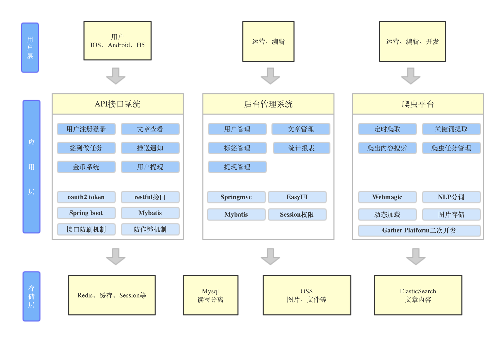
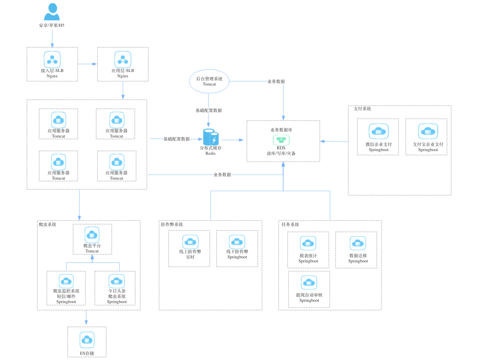

# 项目汇总

一、SpringBoot开发实战

1. [GitHub源码地址](https://github.com/hemin1003/spring-boot-study)

2. 涵盖内容：基本用法，Rest，Controller，事件监听，连接数据库MySQL，jpa，redis集成，mybatis集成（声明式与xml两种方式~对应的添删查改功能），日志处理，devtools配置，拦截器用法，资源配置读取，测试集成，Web层实现请求映射，security安全验证，rabbitMq集成，kafka集成等

3. [学习教程地址](http://blog.csdn.net/hemin1003/article/category/6527486)

二、SpringCloud开发实战

1. [GitHub源码地址](https://github.com/hemin1003/spring-cloud-study)

2. 微服务框架实战，SpringCloud框架入门实战，涉及内容：注册中心，服务提供者，服务消费者，熔断器，配置服务，API Gateway等

3. [学习教程地址](https://github.com/hemin1003/spring-cloud-book)

三、接口API系统开发实战

1. [GitHub源码地址](https://github.com/hemin1003/yfax-parent)

2. 基于SprintBoot开发的Rest API接口项目实战，集成了拦截器，日志处理，mysql，mybatis, oauth2.0, spring secutity等，已投入生产线上使用

3. [学习教程地址](http://blog.csdn.net/hemin1003/article/category/6527486)

四、后台管理系统实战

1. [GitHub源码地址](https://github.com/hemin1003/aylson-parent)

2. 基于SpringMVC4+EasyUI的后台管理系统，已投入生产线上使用

3. [系统体验地址](http://182.92.82.188:8280/manage/login.jsp)，体验账号/密码，test1001 / a12345678

五、Dubbo入门学习实战

1. [GitHub源码地址](https://github.com/hemin1003/dubbo-spring-study)

2. 构建 Zookeeper + Dubbo + Spring Boot 的分布式调用项目

3. [学习教程地址](http://blog.csdn.net/hemin1003/article/details/64439876)

六、JAVA爬虫技术实战

1. [GitHub源码地址](https://github.com/hemin1003/java-spider)

2. 基于webmagic框架二次开发的java爬虫框架实战，已实现能爬取腾讯，搜狐，今日头条（单独集成功能）等资讯内容，配合elasticsearch框架用法，实现了自动爬虫，已投入生产试用中。

3. [学习教程地址](https://gsh199449.github.io/gather_platform_pages/)

七、JAVA技术工具类集合

1. [GitHub源码地址](https://github.com/hemin1003/java-study)

2. JAVA相关技术实现，文件流操作，常用的设计模式，数据结构实现，算法应用和案例，JAVA8一些新特性新功能（Lambda用法，Steam API用法），一致性hash算法代码实现，ELK集成，Hadoop HDFS实现等

3. [相关教程地址](http://blog.csdn.net/hemin1003/article/category/6985523)

八、H5前端（Vue.js）

1. [GitHub源码地址][https://github.com/hemin1003/vue-apps]

2. 注册登录，发送短信验证码，微信登录集成等

持续更新中。。。

PS：

期待和大家一起学习，共同进步

共勉，O(∩_∩)O谢谢

## [关于我](http://heminit.com/about/)

欢迎交流问题，可加QQ469580884，一起探讨交流问题

[我的博客地址](http://blog.csdn.net/hemin1003)

[个人域名](http://heminit.com)

------------------------------------------------
------------------------------------------------
------------------------------------------------

## 补充内容，[博客地址](http://blog.csdn.net/hemin1003/article/details/79555914)

2017年11月参与开发一个信息流项目，主要负责服务器端的架构设计、系统编码和技术落地等

目前日活十万+，给用户返利累计超过两百万，PV五百万+，人均使用时长超过35分钟

这一套架构功能中，除了IOS和Android，其他的都来自于我一个人开发（当然也有基于别人平台二次开发的功能），同时还包括测试、线上运维、集成、部署等，所以一直没有时间整理好来与大家分享、探讨

总算整理出来了，希望抛砖引玉，对大家能有所帮助，不喜勿喷，但建议和交流可以有

1. 系统概要图

2. 系统物理部署图

所使用的技术框架等，都来自于上面我Github的项目上

诚然，虽然这套架构设计上线了运营了，肯定还有更好的方案，但也不怕，自己也一直保持学习的心态，

去向大牛学习，学习先进前沿的架构设计，也不做过度架构设计，一步步脚踏实地，与自身项目相结合，一起成长一起进步

还是那句话：

期待和大家一起学习，共同进步

共勉，O(∩_∩)O谢谢

欢迎交流问题，可加QQ 469580884，一起探讨交流问题
